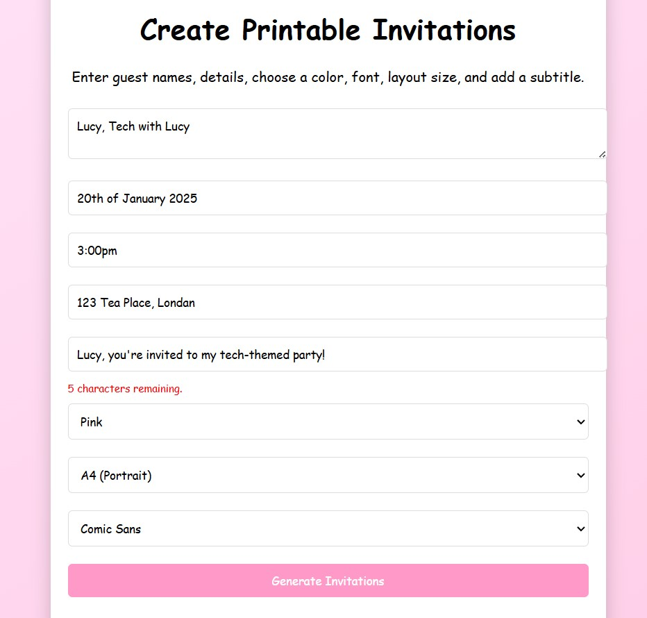

### **Repository Overview:**
**Pretty-Print-Me**  
This project is a website where users can create and print invitation designs. The repository includes the following files:

---

### **Files in the Repository:**

1. **`Lucy Invitation:**
   - A sample image of an invitation titled "Lucy Invitation."
   - A example of what invitations look like
 

2. **`Page.jpg`:**
   - This image shows how the use rinputs invitation dteails

4. **`index.html`:**
   - The main HTML file for the website.
   - Serves as the entry point, containing the structure and content of the web application.

---

